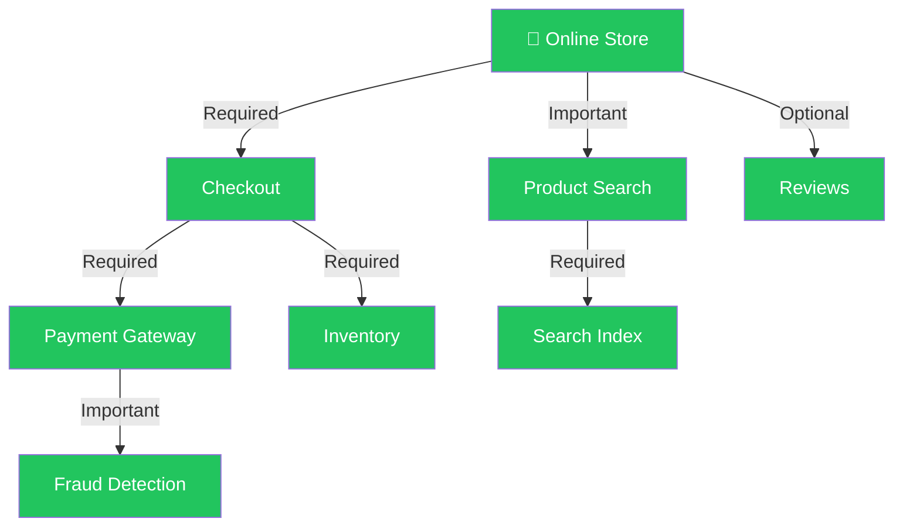

# Prognosis

A dependency-aware service health modeling library for .NET.


```mermaid
graph TD
    Store["🛒 Online Store"] -->|"Required"| Checkout["Checkout"]
    Store -->|"Important"| Search["Product Search"]
    Store -->|"Optional"| Reviews["Reviews"]
    Checkout -->|"Required"| Payment["Payment Gateway"]
    Checkout -->|"Required"| Inventory["Inventory"]
    Payment -->|"Important"| Fraud["Fraud Detection"]
    Search -->|"Required"| Index["Search Index"]

    style Store fill:#22c55e,color:#fff
    style Checkout fill:#22c55e,color:#fff
    style Payment fill:#22c55e,color:#fff
    style Inventory fill:#22c55e,color:#fff
    style Fraud fill:#22c55e,color:#fff
    style Search fill:#22c55e,color:#fff
    style Index fill:#22c55e,color:#fff
    style Reviews fill:#22c55e,color:#fff
```

> **How it works:** each service reports its own health and declares dependencies with an importance level. Prognosis walks the graph and computes the effective status — a **Required** dependency failing makes the parent unhealthy, an **Important** one degrades it, and an **Optional** one is ignored. If Fraud Detection goes down, Payment Gateway becomes *degraded*, which degrades Checkout, which degrades the whole store. If Payment Gateway itself goes down, Checkout becomes *unhealthy* — and since it's Required, the store is unhealthy too. If Reviews go down? Nothing happens.

## Packages

| Package | Purpose |
|---|---|
| [`Prognosis`](https://www.nuget.org/packages/Prognosis) | Core library — health graph modeling, aggregation, monitoring, serialization |
| [`Prognosis.Reactive`](https://www.nuget.org/packages/Prognosis.Reactive) | System.Reactive extensions — Rx-based polling, push-triggered reports, diff-based change streams |
| [`Prognosis.DependencyInjection`](https://www.nuget.org/packages/Prognosis.DependencyInjection) | Microsoft.Extensions.DependencyInjection integration — assembly scanning, fluent graph builder, hosted monitoring |
| [`Prognosis.Generators`](https://www.nuget.org/packages/Prognosis.Generators) | Source generators and analyzers — `HealthNames` constants, `AddDiscoveredNodes()` wiring, and compile-time validation of `DependsOn` edges |

## Key concepts

### Health statuses

| Status | Value | Meaning |
|---|---|---|
| `Healthy` | 0 | Known good |
| `Unknown` | 1 | Not yet **determined** — awaiting a first probe. Expected to be transient *by convention*; nothing enforces it ([ADR-008](docs/adr/008-unknown-must-be-transient.md)) |
| `Degraded` | 2 | Known partial failure |
| `Unhealthy` | 3 | Known failure |

Ordered worst-is-highest so comparisons naturally surface the most severe status.

### Dependency importance

| Importance | Propagation rule |
|---|---|
| `Required` | Dependency status passes through unchanged — an unhealthy dependency makes the parent unhealthy |
| `Important` | Unhealthy is capped at `Degraded` for the parent; `Unknown` and `Degraded` pass through |
| `Optional` | Dependency health is ignored entirely |
| `Resilient` | Like `Required`, but if at least one sibling `Resilient` dependency is healthy, unhealthy is capped at `Degraded`. All `Resilient` siblings must be unhealthy before the parent becomes unhealthy |
| `Advisory` | Like `Important` — unhealthy capped at `Degraded` — **except `Unknown` is absorbed** (contributes `Healthy`). For a probe whose signal may be structurally absent, where "we cannot tell" says nothing about the parent |

### `Important` vs `Advisory`

They differ in exactly one cell — what an **`Unknown`** child does:

| Child status | `Important` → parent | `Advisory` → parent |
|---|---|---|
| `Healthy` | `Healthy` | `Healthy` |
| `Unknown` | **`Unknown`** | **`Healthy`** |
| `Degraded` | `Degraded` | `Degraded` |
| `Unhealthy` | `Degraded` | `Degraded` |

Pick `Advisory` when the dependency is *observed for operators* but the parent's health does not
depend on that observation being **available** — a liveness prober with nothing to probe, a model
that is not loaded, a disabled feature. `Important` would propagate that indeterminacy all the way
to the root; `Optional` would get `Unknown` right but also throw away a genuine failure, which an
advisory probe still wants surfaced.

The trade is deliberate: a wedged advisory probe reports `Healthy` to its parent. The node stays
individually visible in the report and in `Prognosis.Diagnostics` — it just stops speaking for its
parent. If you *want* the indeterminacy to surface, keep `Important`.

> **`Unknown` should be transient — but the library does not enforce that.** It means *not yet
> determined*, not "not applicable", "nothing to measure", or "disabled". Give every `Unknown` a
> resolution path (a first sample, an enumeration, a grace deadline, a probe timeout).
>
> This is a **convention for node authors, not a runtime guarantee**: there is no deadline, no
> expected-by time, and no warning when a node has been `Unknown` too long. Nothing will tell you a
> node is stuck. That matters because `Unknown` never *escalates* a parent past `Unknown`
> (ADR-006) but it does **propagate** — so one permanently-indeterminate leaf silently turns an
> entire tree `Unknown`. If you need enforcement, build it in your shell.
> See [ADR-008](docs/adr/008-unknown-must-be-transient.md).

## Usage patterns

### 1. Expose `HealthNode` properties on a class you own

No base class or interface required — just a public `HealthNode` property:

```csharp
class CacheService
{
    public HealthNode HealthNode { get; }

    public CacheService()
    {
        HealthNode = HealthNode.Create("Cache").WithHealthProbe(
            () => IsConnected
                ? HealthStatus.Healthy
                : HealthEvaluation.Unhealthy("Redis timeout"));
    }

    public bool IsConnected { get; set; } = true;
}
```

For services with fine-grained health attributes, use `HealthNode.Create` backed by sub-nodes:

```csharp
class DatabaseService
{
    public HealthNode HealthNode { get; }

    public bool IsConnected { get; set; } = true;
    public double AverageLatencyMs { get; set; } = 50;
    public double PoolUtilization { get; set; } = 0.3;

    public DatabaseService()
    {
        var connection = HealthNode.Create("Database.Connection").WithHealthProbe(
            () => IsConnected
                ? HealthStatus.Healthy
                : HealthEvaluation.Unhealthy("Connection lost"));

        var latency = HealthNode.Create("Database.Latency").WithHealthProbe(
            () => AverageLatencyMs switch
            {
                > 500 => HealthEvaluation.Degraded(
                    $"Avg latency {AverageLatencyMs:F0}ms exceeds 500ms threshold"),
                _ => HealthStatus.Healthy,
            });

        var connectionPool = HealthNode.Create("Database.ConnectionPool").WithHealthProbe(
            () => PoolUtilization switch
            {
                >= 1.0 => HealthEvaluation.Unhealthy(
                    "Connection pool exhausted"),
                >= 0.9 => HealthEvaluation.Degraded(
                    $"Connection pool at {PoolUtilization:P0} utilization"),
                _ => HealthStatus.Healthy,
            });

        HealthNode = HealthNode.Create("Database")
            .DependsOn(connection, Importance.Required)
            .DependsOn(latency, Importance.Important)
            .DependsOn(connectionPool, Importance.Required);
    }
}
```

The sub-nodes show up automatically in `GetReport`, `RefreshAll`, and the JSON output.

```
Database.Latency: Degraded — Avg latency 600ms exceeds 500ms threshold
Database: Degraded — Database.Latency: Avg latency 600ms exceeds 500ms threshold
AuthService: Degraded — Database: Database.Latency: ...
```

### 2. Wrap a service you can't modify

Use `HealthNode.Create` with `.WithHealthProbe`:

```csharp
var emailHealth = HealthNode.Create("EmailProvider").WithHealthProbe(
    () => client.IsConnected
        ? HealthStatus.Healthy
        : HealthEvaluation.Unhealthy("SMTP connection refused"));
```

### 3. Compose the graph

Wire services together with `DependsOn`:

```csharp
var authService = HealthNode.Create("AuthService")
    .DependsOn(database.HealthNode, Importance.Required)
    .DependsOn(cache.HealthNode, Importance.Important);

var app = HealthNode.Create("Application")
    .DependsOn(authService, Importance.Required)
    .DependsOn(notifications, Importance.Important);
```

### Resilient dependencies

Use `Importance.Resilient` when a parent has multiple paths to the same capability (e.g. primary + replica database). Losing one degrades — but doesn't kill — the parent:

```csharp
// If one goes down but the other is healthy, the parent is degraded (not unhealthy).
// If both go down, the parent becomes unhealthy.
var app = HealthNode.Create("Application")
    .DependsOn(primaryDb, Importance.Resilient)
    .DependsOn(replicaDb, Importance.Resilient);
```

Only `Resilient`-marked siblings participate in the resilience check — `Required`, `Important`, and `Optional` dependencies are unaffected.

## Graph operations

```csharp
var graph = HealthGraph.Create(app);

// Re-evaluate all health probes and return a fresh report
HealthReport report = graph.RefreshAll();

// The root's aggregated status
HealthSnapshot root = report.Root;

// Return the cached report (cheap, no re-evaluation)
HealthReport cached = graph.GetReport();

// Refresh a single node (re-evaluates health probe, propagates upward, emits StatusChanged)
app.Refresh();

// Detect circular dependencies
IReadOnlyList<IReadOnlyList<string>> cycles = graph.DetectCycles();

// Diff two reports to find individual service changes
IReadOnlyList<StatusChange> changes = before.DiffTo(after);
```

## Cross-node health reporting

When a node detects a failure that actually belongs to a different node (root-cause attribution), use `ReportStatus` to push the failure to the correct origin. This ensures all dependents of the origin node are notified via normal propagation — not just the node that detected the problem.

```csharp
var internet = HealthNode.Create("Internet");
var api = HealthNode.Create("API")
    .DependsOn(internet, Importance.Required);
var cache = HealthNode.Create("Cache")
    .DependsOn(internet, Importance.Required);
```

When the API service detects a connectivity failure, it reports the failure on the Internet node:

```csharp
// In the API service's operational code (not the health probe):
catch (HttpRequestException ex) when (IsConnectivityError(ex))
{
    internet.ReportStatus(HealthEvaluation.Unhealthy("Connectivity lost"));
    // → Internet becomes Unhealthy
    // → API and Cache both become Unhealthy via propagation
}
```

The reported status acts as the node's health evaluation until the next probe-based refresh (poll tick or explicit `Refresh`) naturally replaces it — no manual expiration needed.

## Leased verdicts — TTL decay for push-fed nodes

There are three ways to feed a node, and they answer different questions:

| Mode | Shape | When |
|---|---|---|
| `WithHealthProbe` / `ReplaceHealthProbe` | **pull** — the delegate computes health when asked | a live check (`() => _pool.Available > 0`) |
| `ReportStatus` | **one-shot interjection** — consumed by the next wave | root-cause attribution from elsewhere |
| `Lease` / `Affirm` | **standing push with expiry** — the last affirmed verdict, until it decays | a background pump samples a subsystem on its own cadence and pushes the result |

The pull contract is wrong for a producer that samples on its own schedule and caches the result: when the pump dies, the delegate keeps answering with the last (now stale) verdict forever. A **lease** makes the staleness guard unforgeable — declaring the TTL is the same call that hands out the push surface:

```csharp
var (node, lease) = HealthNode.CreateLeased(
    "Database",
    new HealthLeaseOptions(Ttl: TimeSpan.FromSeconds(90)));

while (true)
{
    lease.Affirm(SampleSubsystem());   // push + renewal in one call
    await Task.Delay(interval);
}
```

Each `Affirm` renews the lease. When affirmations stop, the node decays in **two stages**: it reports `Unknown` (`HealthLease.StaleReasonPrefix`) once the age exceeds `Ttl`, then a gating status (default `Degraded`, configurable to `Unhealthy`) once it exceeds `Ttl + EscalateAfter`. A node that never affirms is seeded `Unknown` (`HealthLease.PendingReasonPrefix`, the "never heard from the producer yet" state) and escalates on the same schedule — its reason switches from the pending prefix to `StaleReasonPrefix` once the age crosses `Ttl` — so a producer that never starts fails safe rather than resting green.

> **Adoption requirement:** decay is observed at evaluation time only — the library schedules nothing. A graph containing leased nodes MUST be driven by a wave source (a poll loop, `RefreshAll`, or any propagation) at least as fast as the tightest `Ttl`, or the stale verdict is never re-evaluated and never decays.

## Observable health monitoring

`HealthGraph` exposes push-based observables for health state changes and topology mutations:

```csharp
// Graph-level status changes — emits a HealthReport whenever the effective state changes.
graph.StatusChanged.Subscribe(reportObserver);

// Topology changes — emits on any structural change (nodes added/removed,
// edges added/removed, or an edge's Importance updated). Each TopologyChange
// carries the post-change HealthTopology (ADR-009).
graph.TopologyChanged.Subscribe(topoObserver);

// Timer-based polling with HealthMonitor
await using var monitor = new HealthMonitor(graph, TimeSpan.FromSeconds(5));
monitor.Start();
monitor.ReportChanged.Subscribe(reportObserver);

// Manual poll (useful for testing or getting initial state)
monitor.Poll();
```

`IObservable<T>` is a BCL type — no System.Reactive dependency required. Add System.Reactive only when you want operators like `DistinctUntilChanged()` or `Throttle()`.

### Report-change detection: what counts as a change

Two surfaces detect change over a `HealthReport`, and they answer different questions (ADR-012):

- **Report stream** — `StatusChanged` / `ObserveHealthReport` / `PollHealthReport`, gated by `HealthReportComparer`. Keyed on **`(Name, Status, Reason)`** per node plus the root. A same-status change of `Reason` (e.g. a lease crossing `lease-pending:` → `lease-expired:`) **is** a report change and emits.
- **Transition stream** — `SelectHealthChanges` (built on `HealthReport.DiffTo`). Keyed on **`Status`** only. A reason-only change emits nothing here; the current reason still rides every real status edge.

> **Behavior note (report-equality key).** `HealthReportComparer` keys on `(Name, Status, Reason)` and **excludes `Tags`** — tags are node identity, not a health signal. `GetHashCode` hashes the same three fields as `Equals` (its previous `Name`+`Status`-only hash is retired; **hash values change**, the equivalence relation does not). The one observable effect for a non-lease consumer: two reports that differ *only* by `Tags` now compare **equal** where they compared unequal before, so replacing a live node's tags via `WithTags` no longer fires the report stream on an otherwise health-identical report. In the normal report stream this is a no-op — `RebuildReport` reuses the node's one immutable `Tags` reference every wave — so tag-only diffs did not arise in practice; see ADR-012 §3 and its Migration section. A consumer using `HealthReportComparer.GetHashCode` as a cross-process content digest (an unsupported use — the hash is neither collision-free nor runtime-stable) should move to `Equals` / `DiffTo`.

## Dependency injection

The `Prognosis.DependencyInjection` package provides a fluent builder for configuring the health graph within a hosted application:

```csharp
builder.Services.AddPrognosis(health =>
{
    // Auto-generated — discovers all classes with public HealthNode properties
    // and wires [DependsOn] attribute-declared edges.
    health.AddDiscoveredNodes();

    // Wrap a third-party service with a health probe.
    // Name defaults to typeof(T).Name when omitted.
    health.AddNode("EmailProvider")
        .WithHealthProbe<ThirdPartyEmailClient>(client => client.IsConnected
            ? HealthStatus.Healthy
            : HealthEvaluation.Unhealthy("SMTP refused"));

    // Define composite aggregation nodes.
    health.AddComposite("NotificationSystem", n =>
    {
        n.DependsOn("MessageQueueService", Importance.Required);
        n.DependsOn("EmailProvider", Importance.Optional);
    });

    health.AddComposite("Application", app =>
    {
        app.DependsOn("AuthService", Importance.Required);
        app.DependsOn("NotificationSystem", Importance.Important);
    });

    // Designate the root of the graph. When only one root is declared,
    // a plain HealthGraph singleton is registered.
    health.MarkAsRoot("Application");

    health.UseMonitor(TimeSpan.FromSeconds(30));
});
```

#### Multiple roots (shared nodes, separate graphs)

Call `MarkAsRoot` more than once to materialize several graphs from a single shared node pool. Each graph is registered as a keyed `HealthGraph` (keyed by the root name). Use the generic `MarkAsRoot<T>()` overload to also register a strongly-typed `HealthGraph<T>` for consumers that don't have keyed service support:

```csharp
builder.Services.AddPrognosis(health =>
{
    health.AddDiscoveredNodes();

    health.AddComposite("OpsDashboard", ops =>
    {
        ops.DependsOn("Database", Importance.Required);
        ops.DependsOn("Cache", Importance.Required);
    });

    health.AddComposite("CustomerView", cust =>
    {
        cust.DependsOn("AuthService", Importance.Required);
    });

    // Each MarkAsRoot call produces a separate HealthGraph.
    // Nodes (e.g. DatabaseService) are shared across graphs.
    health.MarkAsRoot<OpsDashboard>();      // registers keyed + HealthGraph<OpsDashboard>
    health.MarkAsRoot<CustomerView>();      // registers keyed + HealthGraph<CustomerView>
});

// Keyed resolution (requires Microsoft.Extensions.DependencyInjection 8+):
var opsGraph    = sp.GetRequiredKeyedService<HealthGraph>("OpsDashboard");
var custGraph   = sp.GetRequiredKeyedService<HealthGraph>("CustomerView");

// Generic resolution (works on any DI container):
var opsGraph    = sp.GetRequiredService<HealthGraph<OpsDashboard>>().Graph;
var custGraph   = sp.GetRequiredService<HealthGraph<CustomerView>>().Graph;
```

Declare dependency edges on `HealthNode` properties with attributes:

```csharp
class AuthService
{
    [DependsOn("Database", Importance.Required)]
    [DependsOn("Cache", Importance.Important)]
    public HealthNode HealthNode { get; } = HealthNode.Create("AuthService");
}
```

Inject `HealthGraph` to access the materialized graph at runtime:

```csharp
var graph = serviceProvider.GetRequiredService<HealthGraph>();
var report = graph.GetReport();

// Type-safe lookup
if (graph.TryGetNode<AuthService>(out var auth))
    Console.WriteLine($"AuthService has {auth.Dependencies.Count} deps");

// String-based lookup still available.
HealthNode dbService = graph["Database"];
```

## Reactive extensions

The `Prognosis.Reactive` package provides Rx-based alternatives to polling. All extensions operate on `HealthGraph`:

```csharp
var graph = HealthGraph.Create(app);

// Timer-driven polling — emits HealthReport on change.
graph.PollHealthReport(TimeSpan.FromSeconds(30))
    .Subscribe(report => Console.WriteLine(report.Nodes.Count));

// Push-triggered — reacts to StatusChanged, no polling delay.
graph.ObserveHealthReport()
    .Subscribe(report => Console.WriteLine(report.Nodes.Count));

// Diff-based change stream — composable with any report source.
graph.PollHealthReport(TimeSpan.FromSeconds(30))
    .SelectHealthChanges()
    .Subscribe(change =>
        Console.WriteLine($"{change.Name}: {change.Previous} → {change.Current}"));
```

### Importance-aware analysis on a report stream

`HealthReport` is flat — no edges, no `Importance` — so the `Prognosis.Diagnostics` layer (`WhatIf` / `Contributors` / `MinimalHealingSet`, ADR-007) can't run on it directly. Do **not** call `CreateTreeSnapshot()` from inside a subscriber: it reads per-node caches without synchronizing against in-flight propagation, so the tree can disagree with the report you were just handed. Instead, recombine the report with the graph's structure via `HealthGraphAnalysis.BuildTreeSnapshot` (ADR-009):

```csharp
// Structure changes only on TopologyChanged — hold it, don't rebuild per beat.
var topology = graph.GetTopology();
graph.TopologyChanged.Subscribe(change => topology = change.Topology);

// Per beat: pure recombination, race-free by construction.
graph.ObserveHealthReport()
    .Select(report => HealthGraphAnalysis.BuildTreeSnapshot(report, topology))
    .Select(HealthGraphAnalysis.Contributors)
    .Subscribe(culprits => Console.WriteLine(string.Join(", ", culprits.Select(c => c.Name))));
```

Within a propagation wave, `TopologyChanged` is observed before `StatusChanged`, so the held topology always describes the report that follows it.

### Sharing streams across subscribers

The Rx helpers produce cold observables — each subscription runs its own pipeline. To share a single evaluation across multiple subscribers, use standard Rx multicast operators directly: `Publish().RefCount()` or `Replay(1).RefCount()`.

## Serialization

Both enums use `[JsonStringEnumConverter]` so they serialize as `"Healthy"` / `"Degraded"` / etc. The `HealthReport` and `HealthSnapshot` records are designed as wire-friendly DTOs:

```json
{
  "Nodes": [
    { "Name": "Database.Connection", "Status": "Healthy" },
    { "Name": "Database.Latency", "Status": "Healthy" },
    { "Name": "Database.ConnectionPool", "Status": "Healthy" },
    { "Name": "Database", "Status": "Healthy" },
    { "Name": "AuthService", "Status": "Healthy" }
  ]
}
```

## Project structure

### Core (`Prognosis`)

| File | Purpose |
|---|---|
| `HealthNode.cs` | Sealed class — `Name`, `Dependencies`, `Parents`, `DependsOn()`, `RemoveDependency()`, `Refresh()`, `ReportStatus()`, `Lease()`, `WithDebounce()`/`WithGrace()`/`MarkLive()`, `IsLeased`/`DebouncePolicy`/`GracePolicy`, factory methods (`Create`, `CreateLeased`, `WithHealthProbe`) |
| `HealthLease.cs` | Leased-verdict push surface — `HealthLease` (`Affirm`), `HealthLeaseOptions`, two-stage TTL decay |
| `TemporalDefaults.cs` | Graph-wide temporal policy defaults (ADR-011 §10) — `TemporalDefaults`, `TemporalPolicyOrigin`, materialized into in-scope nodes at attach |
| `HealthStatus.cs` | `Healthy` → `Unknown` → `Degraded` → `Unhealthy` enum |
| `HealthEvaluation.cs` | Status + optional reason pair, with implicit conversion from `HealthStatus` |
| `Importance.cs` | `Required`, `Important`, `Optional`, `Resilient` enum |
| `HealthDependency.cs` | Record linking a `HealthNode` with its importance |
| `HealthReport.cs` | Serialization-ready report DTO with `DiffTo` for change detection |
| `HealthSnapshot.cs` | Serialization-ready per-service snapshot DTO |
| `StatusChange.cs` | Record describing a single service's status transition |
| `HealthReportComparer.cs` | `IEqualityComparer<HealthReport>` for deduplicating reports |
| `HealthMonitor.cs` | Timer-based poller with `IObservable<HealthReport>` |

### Reactive extensions (`Prognosis.Reactive`)

| File | Purpose |
|---|---|
| `HealthRxExtensions.cs` | `PollHealthReport`, `ObserveHealthReport`, `SelectServiceChanges` |
| `HealthRxShared.cs` | `CreateSharedReportStream`, `CreateSharedObserveStream`, `ShareStrategy` |

### Dependency injection (`Prognosis.DependencyInjection`)

| File | Purpose |
|---|---|
| `ServiceCollectionExtensions.cs` | `AddPrognosis` entry point — service node registration and graph materialization |
| `PrognosisBuilder.cs` | Fluent builder — `AddServiceNode<T>`, `AddNode`, `MarkAsRoot` |
| `NodeConfigurator.cs` | Fluent node definition — `WithHealthProbe<T>`, `DependsOn<T>`, `DependsOn(name)` |
| `DependsOnAttribute.cs` | `[DependsOn("name", Importance)]` property-level attribute for declarative edges |
| `HealthGraph.cs` | Type forwarder for core `HealthGraph` (`Root`, indexer, `GetReport()`) |
| `HealthGraphOfT.cs` | `HealthGraph<TRoot>` typed wrapper for multi-root DI resolution |
| `PrognosisMonitorExtensions.cs` | `UseMonitor` extension + `IHostedService` adapter |

## Source generators and analyzers

The `Prognosis.Generators` package provides compile-time tooling for health graph development. Add it as an analyzer reference:

```xml
<ProjectReference Include="path\to\Prognosis.Generators.csproj"
                  OutputItemType="Analyzer"
                  ReferenceOutputAssembly="false" />
```

### Auto-generated `HealthNames` constants

The generator scans every `HealthNode.Create("name")`, `HealthNode.CreateLeased("name", options)`, `HealthNode.CreateDelegate("name")`, and `HealthNode.CreateComposite("name")` call in your project and emits a `HealthNames` class with `const string` fields:

```csharp
// You write:
var db = HealthNode.Create("Database.Connection").WithHealthProbe(() => ...);
var cache = HealthNode.Create("Cache").WithHealthProbe(() => ...);
var app = HealthNode.Create("Application");

// Generator emits (HealthNames.g.cs):
public static class HealthNames
{
    public const string Application = "Application";
    public const string Cache = "Cache";
    public const string Database_Connection = "Database.Connection";
}
```

Use the generated constants at reference sites for autocomplete, find-all-references, and rename safety:

```csharp
// Instead of:
report.Nodes.First(n => n.Name == "Database.Connection");

// Use:
report.Nodes.First(n => n.Name == HealthNames.Database_Connection);
```

### PROGNOSIS001 — unknown node name

The `DependsOnEdgeAnalyzer` validates string arguments in `DependencyConfigurator.DependsOn("name", ...)` calls against the discovered node names. A typo produces a compile-time warning:

```
warning PROGNOSIS001: Node name 'Databse' does not match any
HealthNode.Create, HealthNode.CreateDelegate, or HealthNode.CreateComposite call in this compilation
```

### Auto-generated `AddDiscoveredNodes()`

When your project references both `Prognosis.DependencyInjection` and `Prognosis.Generators`, the `ServiceNodeDiscoveryGenerator` scans for classes with public `HealthNode` properties and emits an `AddDiscoveredNodes()` extension method on `PrognosisBuilder`:

```csharp
// You write:
class AuthService
{
    [DependsOn("Database", Importance.Required)]
    public HealthNode HealthNode { get; } = HealthNode.Create("AuthService");
}

// Generator emits:
builder.AddServiceNode<AuthService>(svc => svc.HealthNode, deps =>
{
    deps.DependsOn("Database", Importance.Required);
});
```

This replaces the previous reflection-based `ScanForServices()` pattern with zero-reflection, compile-time discovery.

> **Scope:** The generators and analyzer operate within a single compilation. Nodes created at runtime by the DI builder (e.g., `AddDelegate`, `AddComposite`) are not visible to the generator. Use hand-written `const` fields for those names.

## Requirements

- .NET Standard 2.0 or .NET Standard 2.1 compatible runtime (.NET Framework 4.6.1+, .NET Core 2.0+, .NET 5+)
- [System.Text.Json](https://www.nuget.org/packages/System.Text.Json) (bundled as a dependency)
- [Microsoft.Bcl.AsyncInterfaces](https://www.nuget.org/packages/Microsoft.Bcl.AsyncInterfaces) (netstandard2.0 only, bundled as a dependency)
