# Prognosis

**Unfiltered AI slop. Use at your own risk**

A dependency-aware service health modeling library for .NET. Models the health of multiple services as a directed graph where each service's effective status is computed from its own intrinsic health and the weighted health of its dependencies.



```mermaid
graph TD
    Store["🛒 Online Store"] -->|"Required"| Checkout["Checkout"]
    Store -->|"Important"| Search["Product Search"]
    Store -->|"Optional"| Reviews["Reviews"]
    Checkout -->|"Required"| Payment["Payment Gateway"]
    Checkout -->|"Required"| Inventory["Inventory"]
    Payment -->|"Important"| Fraud["Fraud Detection"]
    Search -->|"Required"| Index["Search Index"]

    style Store fill:#22c55e,color:#fff
    style Checkout fill:#22c55e,color:#fff
    style Payment fill:#22c55e,color:#fff
    style Inventory fill:#22c55e,color:#fff
    style Fraud fill:#22c55e,color:#fff
    style Search fill:#22c55e,color:#fff
    style Index fill:#22c55e,color:#fff
    style Reviews fill:#22c55e,color:#fff
```

> **How it works:** each service reports its own health and declares dependencies with an importance level. Prognosis walks the graph and computes the effective status — a **Required** dependency failing makes the parent unhealthy, an **Important** one degrades it, and an **Optional** one is ignored. If Fraud Detection goes down, Payment Gateway becomes *degraded*, which degrades Checkout, which degrades the whole store. If Payment Gateway itself goes down, Checkout becomes *unhealthy* — and since it's Required, the store is unhealthy too. If Reviews go down? Nothing happens.

## Packages

| Package | Purpose |
|---|---|
| [`Prognosis`](https://www.nuget.org/packages/Prognosis) | Core library — health graph modeling, aggregation, monitoring, serialization |
| [`Prognosis.Reactive`](https://www.nuget.org/packages/Prognosis.Reactive) | System.Reactive extensions — Rx-based polling, push-triggered reports, diff-based change streams |
| [`Prognosis.DependencyInjection`](https://www.nuget.org/packages/Prognosis.DependencyInjection) | Microsoft.Extensions.DependencyInjection integration — assembly scanning, fluent graph builder, hosted monitoring |

## Key concepts

### Health statuses

| Status | Value | Meaning |
|---|---|---|
| `Healthy` | 0 | Known good |
| `Unknown` | 1 | Not yet probed (startup state) |
| `Degraded` | 2 | Known partial failure |
| `Unhealthy` | 3 | Known failure |

Ordered worst-is-highest so comparisons naturally surface the most severe status.

### Dependency importance

| Importance | Default propagation rule |
|---|---|
| `Required` | Dependency status passes through unchanged — an unhealthy dependency makes the parent unhealthy |
| `Important` | Unhealthy is capped at `Degraded` for the parent; `Unknown` and `Degraded` pass through |
| `Optional` | Dependency health is ignored entirely |

These rules describe the default strategy (`HealthAggregator.Aggregate`). Propagation behavior can be changed per-service by supplying a custom [aggregation strategy](#aggregation-strategies).

## Usage patterns

### 1. Implement `IServiceHealth` on a class you own

Embed a `ServiceHealthTracker` and delegate to it:

```csharp
class DatabaseService : IObservableServiceHealth
{
    private readonly ServiceHealthTracker _health;

    public DatabaseService()
    {
        _health = new ServiceHealthTracker(
            () => IsConnected
                ? HealthStatus.Healthy
                : new HealthEvaluation(HealthStatus.Unhealthy, "Connection lost"));
    }

    public bool IsConnected { get; set; } = true;

    public string Name => "Database";
    public IReadOnlyList<ServiceDependency> Dependencies => _health.Dependencies;
    public IObservable<HealthStatus> StatusChanged => _health.StatusChanged;
    public void NotifyChanged() => _health.NotifyChanged();
    public HealthEvaluation Evaluate() => _health.Evaluate();
}
```

### 2. Wrap a service you can't modify

Use `DelegatingServiceHealth` with a health-check delegate:

```csharp
var emailHealth = new DelegatingServiceHealth("EmailProvider",
    () => client.IsConnected
        ? HealthStatus.Healthy
        : new HealthEvaluation(HealthStatus.Unhealthy, "SMTP connection refused"));
```

### 3. Pure composite aggregation

Create virtual aggregation points with no backing service:

```csharp
// List style
var app = new CompositeServiceHealth("Application",
[
    new ServiceDependency(authService, ServiceImportance.Required),
    new ServiceDependency(notifications, ServiceImportance.Important),
]);

// Fluent style
var app = new CompositeServiceHealth("Application")
    .DependsOn(authService, ServiceImportance.Required)
    .DependsOn(notifications, ServiceImportance.Important);
```

## Aggregation strategies

By default, health propagation follows the rules in [Dependency importance](#dependency-importance) via `HealthAggregator.Aggregate`. You can swap the strategy per-service to change how dependency statuses combine.

### Built-in strategies

| Strategy | Behavior |
|---|---|
| `HealthAggregator.Aggregate` | **Default.** Worst-case propagation — a single unhealthy Required dependency makes the parent unhealthy. |
| `HealthAggregator.AggregateWithRedundancy` | Redundancy-aware — when at least one non-optional dependency is healthy, a Required dependency's unhealthy status is capped at Degraded. All non-optional deps must be unhealthy before the parent becomes unhealthy. |

### Using a built-in strategy

```csharp
// Without redundancy (default) — if either service goes down, the parent is unhealthy.
var app = new CompositeServiceHealth("Application")
    .DependsOn(primaryDb, ServiceImportance.Required)
    .DependsOn(replicaDb, ServiceImportance.Required);

// With redundancy — if one goes down but the other is healthy, the parent is degraded.
var app = new CompositeServiceHealth("Application",
    aggregator: HealthAggregator.AggregateWithRedundancy)
    .DependsOn(primaryDb, ServiceImportance.Required)
    .DependsOn(replicaDb, ServiceImportance.Required);
```

### Custom strategies

The `AggregationStrategy` delegate takes intrinsic health + dependencies and returns an evaluation. Pass any matching function:

```csharp
var app = new CompositeServiceHealth("Application",
    aggregator: (intrinsic, deps) =>
    {
        // Your custom logic here
        return new HealthEvaluation(HealthStatus.Healthy);
    });
```

Strategies can also be applied to `DelegatingServiceHealth` and `ServiceHealthTracker`:

```csharp
// DelegatingServiceHealth with a strategy
var svc = new DelegatingServiceHealth("Service", healthCheck,
    aggregator: HealthAggregator.AggregateWithRedundancy);

// ServiceHealthTracker (when embedding in your own class)
var tracker = new ServiceHealthTracker(intrinsicCheck,
    aggregator: HealthAggregator.AggregateWithRedundancy);
```

## Graph operations

```csharp
// Evaluate a single service (walks its dependencies)
HealthEvaluation eval = app.Evaluate();

// Snapshot the entire graph (depth-first post-order)
IReadOnlyList<ServiceSnapshot> snapshots = HealthAggregator.EvaluateAll(app);

// Package as a serialization-ready report with timestamp
HealthReport report = HealthAggregator.CreateReport(app);

// Detect circular dependencies
IReadOnlyList<IReadOnlyList<string>> cycles = HealthAggregator.DetectCycles(app);

// Diff two reports to find individual service changes
IReadOnlyList<ServiceStatusChange> changes = HealthAggregator.Diff(before, after);
```

## Observable health monitoring

All built-in types implement `IObservableServiceHealth`. Subscribe to individual services or monitor the full graph:

```csharp
// Individual service notifications
database.StatusChanged.Subscribe(observer);

// Graph-level polling with HealthMonitor
await using var monitor = new HealthMonitor([app], TimeSpan.FromSeconds(5));
monitor.ReportChanged.Subscribe(reportObserver);

// Manual poll (useful for testing or getting initial state)
monitor.Poll();
```

`IObservable<T>` is a BCL type — no System.Reactive dependency required. Add System.Reactive only when you want operators like `DistinctUntilChanged()` or `Throttle()`.

## Dependency injection

The `Prognosis.DependencyInjection` package provides a fluent builder for configuring the health graph within a hosted application:

```csharp
builder.Services.AddPrognosis(health =>
{
    // Discover all IServiceHealth implementations and wire [DependsOn<T>] attributes.
    health.ScanForServices(typeof(Program).Assembly);

    // Wrap a third-party service with a health delegate.
    health.AddDelegate<ThirdPartyEmailClient>("EmailProvider",
        client => client.IsConnected
            ? HealthStatus.Healthy
            : new HealthEvaluation(HealthStatus.Unhealthy, "SMTP refused"));

    // Define composite aggregation nodes.
    health.AddComposite("Application", app =>
    {
        app.DependsOn<AuthService>(ServiceImportance.Required);
        app.DependsOn("NotificationSystem", ServiceImportance.Important);
    });

    // Composites with custom aggregation strategies.
    health.AddComposite("DatabaseCluster", db =>
    {
        db.DependsOn("PrimaryDb", ServiceImportance.Required);
        db.DependsOn("ReplicaDb", ServiceImportance.Required);
    }, aggregator: HealthAggregator.AggregateWithRedundancy);

    health.AddRoots("Application");
    health.UseMonitor(TimeSpan.FromSeconds(30));
});
```

Declare dependency edges on classes you own with attributes:

```csharp
[DependsOn<DatabaseService>(ServiceImportance.Required)]
[DependsOn<CacheService>(ServiceImportance.Important)]
class AuthService : IObservableServiceHealth
{
    private readonly ServiceHealthTracker _health = new();

    public string Name => "AuthService";
    public IReadOnlyList<ServiceDependency> Dependencies => _health.Dependencies;
    public IObservable<HealthStatus> StatusChanged => _health.StatusChanged;
    public void NotifyChanged() => _health.NotifyChanged();
    public HealthEvaluation Evaluate() => _health.Evaluate();
}
```

Inject `HealthGraph` to access the materialized graph at runtime:

```csharp
var graph = serviceProvider.GetRequiredService<HealthGraph>();
var report = graph.CreateReport();
var dbService = graph["Database"];
```

## Reactive extensions

The `Prognosis.Reactive` package provides Rx-based alternatives to polling:

```csharp
var roots = new IServiceHealth[] { app };

// Timer-driven polling — emits HealthReport on change.
roots.PollHealthReport(TimeSpan.FromSeconds(30))
    .Subscribe(report => Console.WriteLine(report.OverallStatus));

// Push-triggered — reacts to leaf StatusChanged events, throttled.
roots.ObserveHealthReport(TimeSpan.FromMilliseconds(500))
    .Subscribe(report => Console.WriteLine(report.OverallStatus));

// Diff-based change stream — composable with any report source.
roots.PollHealthReport(TimeSpan.FromSeconds(30))
    .SelectServiceChanges()
    .Subscribe(change =>
        Console.WriteLine($"{change.Name}: {change.Previous} → {change.Current}"));
```

## Serialization

Both enums use `[JsonStringEnumConverter]` so they serialize as `"Healthy"` / `"Degraded"` / etc. The `HealthReport` and `ServiceSnapshot` records are designed as wire-friendly DTOs:

```json
{
  "Timestamp": "2026-02-13T18:30:00+00:00",
  "OverallStatus": "Healthy",
  "Services": [
    { "Name": "Database", "Status": "Healthy", "DependencyCount": 0 },
    { "Name": "AuthService", "Status": "Healthy", "DependencyCount": 2 }
  ]
}
```

## Project structure

### Core (`Prognosis`)

| File | Purpose |
|---|---|
| `IServiceHealth.cs` | Core interface — `Name`, `Dependencies`, `Evaluate()` |
| `IObservableServiceHealth.cs` | Extends `IServiceHealth` with `StatusChanged` and `NotifyChanged()` |
| `HealthStatus.cs` | `Healthy` → `Unknown` → `Degraded` → `Unhealthy` enum |
| `HealthEvaluation.cs` | Status + optional reason pair, with implicit conversion from `HealthStatus` |
| `ServiceImportance.cs` | `Required`, `Important`, `Optional` enum |
| `ServiceDependency.cs` | Record linking an `IServiceHealth` with its importance |
| `AggregationStrategy.cs` | Delegate type for pluggable propagation rules |
| `ServiceHealthTracker.cs` | Composable helper — embed in any class for dependency tracking, aggregation, and observability |
| `DelegatingServiceHealth.cs` | Adapter wrapping a `Func<HealthEvaluation>` for closed types |
| `CompositeServiceHealth.cs` | Pure aggregation point with no backing service |
| `HealthAggregator.cs` | Static helpers — `Aggregate`, `AggregateWithRedundancy`, `EvaluateAll`, `CreateReport`, `DetectCycles`, `Diff`, `NotifyGraph` |
| `HealthReport.cs` | Serialization-ready report DTO |
| `ServiceSnapshot.cs` | Serialization-ready per-service snapshot DTO |
| `ServiceStatusChange.cs` | Record describing a single service's status transition |
| `HealthReportComparer.cs` | `IEqualityComparer<HealthReport>` for deduplicating reports |
| `HealthMonitor.cs` | Timer-based poller with `IObservable<HealthReport>` |

### Reactive extensions (`Prognosis.Reactive`)

| File | Purpose |
|---|---|
| `ServiceHealthRxExtensions.cs` | `PollHealthReport`, `ObserveHealthReport`, `SelectServiceChanges` |

### Dependency injection (`Prognosis.DependencyInjection`)

| File | Purpose |
|---|---|
| `ServiceCollectionExtensions.cs` | `AddPrognosis` entry point — assembly scanning and graph materialization |
| `PrognosisBuilder.cs` | Fluent builder — `ScanForServices`, `AddDelegate<T>`, `AddComposite`, `AddRoots` |
| `DependencyConfigurator.cs` | Fluent edge declaration — `DependsOn<T>`, `DependsOn(name)` |
| `DependsOnAttribute.cs` | `[DependsOn<T>]` attribute for declarative dependency edges |
| `HealthGraph.cs` | Materialized graph container — `Roots`, indexer, `CreateReport()` |
| `PrognosisMonitorExtensions.cs` | `UseMonitor` extension + `IHostedService` adapter |

## Requirements

- .NET Standard 2.0 or .NET Standard 2.1 compatible runtime (.NET Framework 4.6.1+, .NET Core 2.0+, .NET 5+)
- [System.Text.Json](https://www.nuget.org/packages/System.Text.Json) (bundled as a dependency)
- [Microsoft.Bcl.AsyncInterfaces](https://www.nuget.org/packages/Microsoft.Bcl.AsyncInterfaces) (netstandard2.0 only, bundled as a dependency)
