# Prognosis

**Unfiltered AI slop. Use at your own risk**

A dependency-aware service health modeling library for .NET. Models the health of multiple services as a directed graph where each service's effective status is computed from its own intrinsic health and the weighted health of its dependencies.



```mermaid
graph TD
    Store["🛒 Online Store"] -->|"Required"| Checkout["Checkout"]
    Store -->|"Important"| Search["Product Search"]
    Store -->|"Optional"| Reviews["Reviews"]
    Checkout -->|"Required"| Payment["Payment Gateway"]
    Checkout -->|"Required"| Inventory["Inventory"]
    Payment -->|"Important"| Fraud["Fraud Detection"]
    Search -->|"Required"| Index["Search Index"]

    style Store fill:#22c55e,color:#fff
    style Checkout fill:#22c55e,color:#fff
    style Payment fill:#22c55e,color:#fff
    style Inventory fill:#22c55e,color:#fff
    style Fraud fill:#22c55e,color:#fff
    style Search fill:#22c55e,color:#fff
    style Index fill:#22c55e,color:#fff
    style Reviews fill:#22c55e,color:#fff
```

> **How it works:** each service reports its own health and declares dependencies with an importance level. Prognosis walks the graph and computes the effective status — a **Required** dependency failing makes the parent unhealthy, an **Important** one degrades it, and an **Optional** one is ignored. If Fraud Detection goes down, Payment Gateway becomes *degraded*, which degrades Checkout, which degrades the whole store. If Payment Gateway itself goes down, Checkout becomes *unhealthy* — and since it's Required, the store is unhealthy too. If Reviews go down? Nothing happens.

## Packages

| Package | Purpose |
|---|---|
| [`Prognosis`](https://www.nuget.org/packages/Prognosis) | Core library — health graph modeling, aggregation, monitoring, serialization |
| [`Prognosis.Reactive`](https://www.nuget.org/packages/Prognosis.Reactive) | System.Reactive extensions — Rx-based polling, push-triggered reports, diff-based change streams |
| [`Prognosis.DependencyInjection`](https://www.nuget.org/packages/Prognosis.DependencyInjection) | Microsoft.Extensions.DependencyInjection integration — assembly scanning, fluent graph builder, hosted monitoring |

## Key concepts

### Health statuses

| Status | Value | Meaning |
|---|---|---|
| `Healthy` | 0 | Known good |
| `Unknown` | 1 | Not yet probed (startup state) |
| `Degraded` | 2 | Known partial failure |
| `Unhealthy` | 3 | Known failure |

Ordered worst-is-highest so comparisons naturally surface the most severe status.

### Dependency importance

| Importance | Propagation rule |
|---|---|
| `Required` | Dependency status passes through unchanged — an unhealthy dependency makes the parent unhealthy |
| `Important` | Unhealthy is capped at `Degraded` for the parent; `Unknown` and `Degraded` pass through |
| `Optional` | Dependency health is ignored entirely |
| `Resilient` | Like `Required`, but if at least one sibling `Resilient` dependency is healthy, unhealthy is capped at `Degraded`. All `Resilient` siblings must be unhealthy before the parent becomes unhealthy |

## Usage patterns

### 1. Implement `IHealthAware` on a class you own

Expose a `HealthNode` property — no forwarding boilerplate:

```csharp
class CacheService : IHealthAware
{
    public HealthNode Health { get; }

    public CacheService()
    {
        Health = new HealthCheck("Cache",
            () => IsConnected
                ? HealthStatus.Healthy
                : new HealthEvaluation(HealthStatus.Unhealthy, "Redis timeout"));
    }

    public bool IsConnected { get; set; } = true;
}
```

For services with fine-grained health attributes, use a `HealthGroup` backed by sub-nodes:

```csharp
class DatabaseService : IHealthAware
{
    public HealthNode Health { get; }

    public bool IsConnected { get; set; } = true;
    public double AverageLatencyMs { get; set; } = 50;
    public double PoolUtilization { get; set; } = 0.3;

    public DatabaseService()
    {
        var connection = new HealthCheck("Database.Connection",
            () => IsConnected
                ? HealthStatus.Healthy
                : new HealthEvaluation(HealthStatus.Unhealthy, "Connection lost"));

        var latency = new HealthCheck("Database.Latency",
            () => AverageLatencyMs switch
            {
                > 500 => new HealthEvaluation(HealthStatus.Degraded,
                    $"Avg latency {AverageLatencyMs:F0}ms exceeds 500ms threshold"),
                _ => HealthStatus.Healthy,
            });

        var connectionPool = new HealthCheck("Database.ConnectionPool",
            () => PoolUtilization switch
            {
                >= 1.0 => new HealthEvaluation(HealthStatus.Unhealthy,
                    "Connection pool exhausted"),
                >= 0.9 => new HealthEvaluation(HealthStatus.Degraded,
                    $"Connection pool at {PoolUtilization:P0} utilization"),
                _ => HealthStatus.Healthy,
            });

        Health = new HealthGroup("Database")
            .DependsOn(connection, Importance.Required)
            .DependsOn(latency, Importance.Important)
            .DependsOn(connectionPool, Importance.Required);
    }
}
```

The sub-nodes show up automatically in `EvaluateAll`, `CreateReport`, and the JSON output. Reason strings chain from the leaf all the way up:

```
Database.Latency: Degraded — Avg latency 600ms exceeds 500ms threshold
Database: Degraded (3 dependencies) — Database.Latency: Avg latency 600ms exceeds 500ms threshold
AuthService: Degraded (2 dependencies) — Database: Database.Latency: ...
```

### 2. Wrap a service you can't modify

Use `HealthCheck` with a health-check delegate:

```csharp
var emailHealth = new HealthCheck("EmailProvider",
    () => client.IsConnected
        ? HealthStatus.Healthy
        : new HealthEvaluation(HealthStatus.Unhealthy, "SMTP connection refused"));
```

### 3. Compose the graph

Wire services together with `DependsOn`:

```csharp
var authService = new HealthCheck("AuthService")
    .DependsOn(database.Health, Importance.Required)
    .DependsOn(cache.Health, Importance.Important);

var app = new HealthGroup("Application")
    .DependsOn(authService, Importance.Required)
    .DependsOn(notifications, Importance.Important);
```

### Resilient dependencies

Use `Importance.Resilient` when a parent has multiple paths to the same capability (e.g. primary + replica database). Losing one degrades — but doesn't kill — the parent:

```csharp
// If one goes down but the other is healthy, the parent is degraded (not unhealthy).
// If both go down, the parent becomes unhealthy.
var app = new HealthGroup("Application")
    .DependsOn(primaryDb, Importance.Resilient)
    .DependsOn(replicaDb, Importance.Resilient);
```

Only `Resilient`-marked siblings participate in the resilience check — `Required`, `Important`, and `Optional` dependencies are unaffected.

## Graph operations

```csharp
var graph = HealthGraph.Create(app);

// Evaluate a single service (walks its dependencies)
HealthEvaluation eval = app.Evaluate();

// Snapshot the entire graph (depth-first post-order)
IReadOnlyList<HealthSnapshot> snapshots = graph.EvaluateAll();

// Package as a serialization-ready report with timestamp
HealthReport report = graph.CreateReport();

// Detect circular dependencies
IReadOnlyList<IReadOnlyList<string>> cycles = graph.DetectCycles();

// Diff two reports to find individual service changes
IReadOnlyList<StatusChange> changes = before.Diff(after);
```

## Observable health monitoring

Every `HealthNode` node supports push-based notifications. Subscribe to individual services or monitor the full graph:

```csharp
// Individual service notifications
database.Health.StatusChanged.Subscribe(observer);

// Graph-level polling with HealthMonitor
await using var monitor = new HealthMonitor(graph, TimeSpan.FromSeconds(5));
monitor.ReportChanged.Subscribe(reportObserver);

// Manual poll (useful for testing or getting initial state)
monitor.Poll();
```

`IObservable<T>` is a BCL type — no System.Reactive dependency required. Add System.Reactive only when you want operators like `DistinctUntilChanged()` or `Throttle()`.

## Dependency injection

The `Prognosis.DependencyInjection` package provides a fluent builder for configuring the health graph within a hosted application:

```csharp
builder.Services.AddPrognosis(health =>
{
    // Discover all IHealthAware implementations and wire [DependsOn<T>] attributes.
    health.ScanForServices(typeof(Program).Assembly);

    // Wrap a third-party service with a health delegate.
    // Name defaults to typeof(T).Name when omitted.
    health.AddDelegate<ThirdPartyEmailClient>("EmailProvider",
        client => client.IsConnected
            ? HealthStatus.Healthy
            : new HealthEvaluation(HealthStatus.Unhealthy, "SMTP refused"));

    // Define composite aggregation nodes.
    // Use nameof for concrete types, constants for virtual nodes.
    health.AddComposite(ServiceNames.Application, app =>
    {
        app.DependsOn<AuthService>(Importance.Required);
        app.DependsOn(ServiceNames.NotificationSystem, Importance.Important);
    });

    // Composites with custom aggregation strategies.
    health.AddComposite(ServiceNames.DatabaseCluster, db =>
    {
        db.DependsOn(nameof(PrimaryDb), Importance.Required);
        db.DependsOn(nameof(ReplicaDb), Importance.Required);
    }, aggregator: HealthAggregator.AggregateWithRedundancy);

    // Roots are discovered automatically — any node that no other node
    // depends on is a root. No manual configuration is needed.
    health.UseMonitor(TimeSpan.FromSeconds(30));
});

// Central constants for virtual/composite service names.
static class ServiceNames
{
    public const string Application = nameof(Application);
    public const string NotificationSystem = nameof(NotificationSystem);
    public const string DatabaseCluster = nameof(DatabaseCluster);
}
```

Declare dependency edges on classes you own with attributes:

```csharp
[DependsOn<DatabaseService>(Importance.Required)]
[DependsOn<CacheService>(Importance.Important)]
class AuthService : IHealthAware
{
    public HealthNode Health { get; } = new HealthCheck("AuthService");
}
```

Inject `HealthGraph` to access the materialized graph at runtime:

```csharp
var graph = serviceProvider.GetRequiredService<HealthGraph>();
var report = graph.CreateReport();

// Type-safe lookup — uses typeof(AuthService).Name as key.
if (graph.TryGetService<AuthService>(out var auth))
    Console.WriteLine($"AuthService has {auth.Dependencies.Count} deps");

// String-based lookup still available.
var dbService = graph["Database"];
```

## Reactive extensions

The `Prognosis.Reactive` package provides Rx-based alternatives to polling:

```csharp
var roots = new HealthNode[] { app };

// Timer-driven polling — emits HealthReport on change.
roots.PollHealthReport(TimeSpan.FromSeconds(30))
    .Subscribe(report => Console.WriteLine(report.OverallStatus));

// Push-triggered — reacts to leaf StatusChanged events, throttled.
roots.ObserveHealthReport(TimeSpan.FromMilliseconds(500))
    .Subscribe(report => Console.WriteLine(report.OverallStatus));

// Diff-based change stream — composable with any report source.
roots.PollHealthReport(TimeSpan.FromSeconds(30))
    .SelectServiceChanges()
    .Subscribe(change =>
        Console.WriteLine($"{change.Name}: {change.Previous} → {change.Current}"));
```

### Sharing streams across subscribers

The Rx helpers produce cold observables — each subscription runs its own pipeline. To share a single evaluation across multiple subscribers:

```csharp
// Auto-stop when last subscriber unsubscribes.
var shared = roots.CreateSharedReportStream(TimeSpan.FromSeconds(30));

// Replay latest report to late subscribers.
var shared = roots.CreateSharedReportStream(TimeSpan.FromSeconds(30),
    ShareStrategy.ReplayLatest);

// Push-triggered variant.
var shared = roots.CreateSharedObserveStream(TimeSpan.FromMilliseconds(500));
```

Or use standard Rx multicast operators directly: `Publish().RefCount()` or `Replay(1).RefCount()`.

## Serialization

Both enums use `[JsonStringEnumConverter]` so they serialize as `"Healthy"` / `"Degraded"` / etc. The `HealthReport` and `HealthSnapshot` records are designed as wire-friendly DTOs:

```json
{
  "Timestamp": "2026-02-13T18:30:00+00:00",
  "OverallStatus": "Healthy",
  "Services": [
    { "Name": "Database.Connection", "Status": "Healthy", "DependencyCount": 0 },
    { "Name": "Database.Latency", "Status": "Healthy", "DependencyCount": 0 },
    { "Name": "Database.ConnectionPool", "Status": "Healthy", "DependencyCount": 0 },
    { "Name": "Database", "Status": "Healthy", "DependencyCount": 3 },
    { "Name": "AuthService", "Status": "Healthy", "DependencyCount": 2 }
  ]
}
```

## Project structure

### Core (`Prognosis`)

| File | Purpose |
|---|---|
| `HealthNode.cs` | Abstract base class — `Name`, `Dependencies`, `Evaluate()`, `StatusChanged`, `NotifyChanged()`, `DependsOn()` |
| `IHealthAware.cs` | Marker interface — implement on your classes with a single `HealthNode Health` property |
| `HealthStatus.cs` | `Healthy` → `Unknown` → `Degraded` → `Unhealthy` enum |
| `HealthEvaluation.cs` | Status + optional reason pair, with implicit conversion from `HealthStatus` |
| `Importance.cs` | `Required`, `Important`, `Optional` enum |
| `HealthDependency.cs` | Record linking a `HealthNode` with its importance |
| `AggregationStrategy.cs` | Delegate type for pluggable propagation rules |
| `HealthTracker.cs` | Internal composable helper — dependency tracking, aggregation, and observability |
| `HealthCheck.cs` | Wraps a `Func<HealthEvaluation>` — use for services with intrinsic health checks |
| `HealthGroup.cs` | Pure aggregation point — health derived entirely from dependencies |
| `HealthAggregator.cs` | Static helpers — `Aggregate`, `AggregateWithRedundancy`, `EvaluateAll`, `CreateReport`, `DetectCycles`, `Diff`, `NotifyGraph` |
| `HealthReport.cs` | Serialization-ready report DTO |
| `HealthSnapshot.cs` | Serialization-ready per-service snapshot DTO |
| `StatusChange.cs` | Record describing a single service's status transition |
| `HealthReportComparer.cs` | `IEqualityComparer<HealthReport>` for deduplicating reports |
| `HealthMonitor.cs` | Timer-based poller with `IObservable<HealthReport>` |

### Reactive extensions (`Prognosis.Reactive`)

| File | Purpose |
|---|---|
| `HealthRxExtensions.cs` | `PollHealthReport`, `ObserveHealthReport`, `SelectServiceChanges` |
| `HealthRxShared.cs` | `CreateSharedReportStream`, `CreateSharedObserveStream`, `ShareStrategy` |

### Dependency injection (`Prognosis.DependencyInjection`)

| File | Purpose |
|---|---|
| `ServiceCollectionExtensions.cs` | `AddPrognosis` entry point — assembly scanning and graph materialization |
| `PrognosisBuilder.cs` | Fluent builder — `ScanForServices`, `AddDelegate<T>`, `AddComposite` |
| `DependencyConfigurator.cs` | Fluent edge declaration — `DependsOn<T>`, `DependsOn(name)` |
| `DependsOnAttribute.cs` | `[DependsOn<T>]` attribute for declarative dependency edges |
| `HealthGraph.cs` | Materialized graph container — `Roots`, indexer, `CreateReport()` |
| `PrognosisMonitorExtensions.cs` | `UseMonitor` extension + `IHostedService` adapter |

## Requirements

- .NET Standard 2.0 or .NET Standard 2.1 compatible runtime (.NET Framework 4.6.1+, .NET Core 2.0+, .NET 5+)
- [System.Text.Json](https://www.nuget.org/packages/System.Text.Json) (bundled as a dependency)
- [Microsoft.Bcl.AsyncInterfaces](https://www.nuget.org/packages/Microsoft.Bcl.AsyncInterfaces) (netstandard2.0 only, bundled as a dependency)
